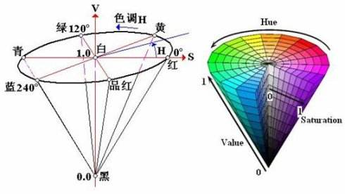
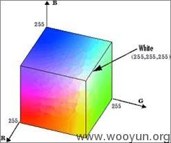
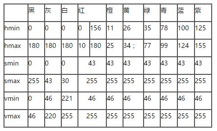
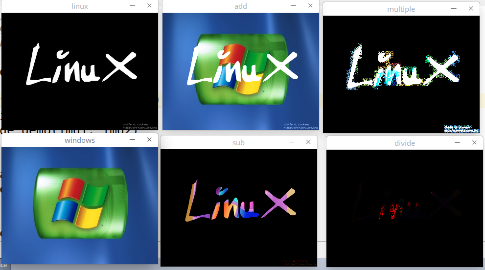

# 图像的色彩空间
色彩空间是一个颜色显示的模型，比如RGB,HSV,YCrCb,YUV.
下图是RGB和HSV色彩空间的模型图：



介绍常用的集中颜色表示模型:
RGB: opencv里是BGR, 三颜色通道，  
HSV: 最常用的颜色空间，H(Hue)指色调，S(Saturation)指饱和度，V(value)指明度  
饱和度S是指白色在色调里混合的比例，色调H是固定的，S越高混合的白色越多，越趋近与白色(但其实可以是任何的颜色，这里为了解释方便,互补的颜色混合起来就是灰色)；
V是明度, 明度也是颜色本身的属性，不是光线的属性，而是颜色本身被人解读为的光线的属性  
不管哪一个色调，V值越小，明度越低，色调就越灰暗，趋近于黑色,但不会完全趋近黑色, 暗黑浓的色一般都是v值低的   
白色的V值变化就是V值的变化  
从HSV锥形图中可以看出H的取值范围应该是360, 但是超过了opencv中图像的uint8表示范围0-255, 
所以正则化180.  S和V的取值着没有特别规定，按0-255取值.  
所以取值范围为: H in [0, 180], S in [0, 255], V in [0, 255]  
下图是常用的hsv取值范围, 在设置或者过滤颜色的时候就非常有用了： 

YCrCb: 为识别人的皮肤的模型  
人皮肤检测参考：
http://blog.csdn.net/wzmsltw/article/details/50658744  
YUV： android中的摄像头获取到的颜色模型  
CMY: 早期的射线屏幕使用，现在都已经是RGB模型

RGB和CMY颜色模型都是面向硬件的，而HSV（Hue Saturation Value）颜色模型是面向用户的。

以上中都有对应的API提供可以转换  

# 色彩空间转换API
```
cv.cvtColor(img, cv.COLOR_BRG2HSV)
cv.cvtColor(img, cv.COLOR_BRG2GRAY)
```

# inRange函数
inRange函数对图像的颜色内容的提取，跟踪非常有用，是关键一步！ 这就是特征的提取！！！      
inRange提取函数返回的是二值化后的单维度图像，这是针对多维度的函数，不仅仅是3通道，可以3维度的数据的一起用
针对图片：
```
hsv_jump = cv.cvtColor(jump, cv.COLOR_BGR2HSV)
cv.imshow("hsv jump", hsv_jump)
lower_bound = (105, 25, 45)
upper_bound = (135, 125, 130)
range_jump = cv.inRange(hsv_jump, lower_bound, upper_bound)
cv.imshow("range jump", range_jump)
```
使用更多维度的数据测试irange的时候并没有成功，该函数只能用于颜色处理,不过思想是可以借鉴的！
```
    test_raw = np.ones((400,400,10,10), np.uint8)
    test_raw[:,:,:,:] = 200
    test_raw[0:400:2,0:400:2,:,:] = 127
    test_raw[0:400:2,0:400:2,::3,::3] = 180
    lower_bound = (100, 100, 100, 100)
    upper_bound = (150, 150, 150, 150)
    test_range = cv.inRange(test_raw, lower_bound, upper_bound)
    print(test_raw.shape)
    print(test_range.shape)
    cv.imshow("test range", test_range)
```

threshhold只能处理单维度的数据


# 通道分离和合并  
一定要记住图片数据也是narray数据，用线性代数的方式来解决, 要分清楚维度和颜色通道的区别，颜色通道只是一个维度  
如果是4种基础色，通道可能就是4，但只是一个维度  
通道分离就是降低一个维度的过程，将一个维度分开为多个面而已, 自己体会下  
颜色通道的合并就是增加一个颜色通道的维度而已   
opencv中提供了这样的线性操作的函数   
eg:  
```
b,g,r = cv.split(jump)
cv.imshow("b", b)
cv.imshow("g", g)
cv.imshow("r", r)

jump[:,:,2] = 0
cv.imshow("b&g", jump)

test_r = np.ones((960, 540), np.uint8)
test_r[:,:] *= 127
merge_jump = cv.merge((b, g, test_r))
cv.imshow("merge", merge_jump)
```


# 像素运算
相同size大小的图片(即相同维度和大小numpy.array的数组)才可以进行运算操作！  
基本运算：  
加，减，乘，除  
值得注意的是算术运算中的值会被截断，最后的区间会落在[0, 255]之间，尤其是subtract减法运算效果会多一些，就是遮罩  
黑色是0， 白色是255  
相关api:
img = cv.add(img1, img2) //返回新的img, 大于255的截断为255
img = cv.subtract(img1, img2)  //返回新的img, 小于0的被截断为0，如果是白色255减去其他颜色，结果直接就是这种颜色的补色
img = cv.multiply(img1, img2) //会将边缘锯齿放大
img = cv.divide(img1, img2)  //效果不明显
效果如下图：


基本逻辑运算：  
and, or, not  
逻辑操作多用作图像的提取，因为0位与任何图像bit位and都是0， 1与任何图像bit位都是1  
而not操作取反就可以取颜色的补色  
or操作就是图像的叠加啊！！比减法好使！  

二值化的图像真的非常有用，基本就是拿来提取图像的！  
注意一点的是inRange函数的得到是单通道的数据,所以在bitwise_and的时候要传两张一样的图片，然后指定mask,否则维度不一样，不能做操作


只有黑白两种颜色一般叫做遮罩层，或叫mask层


# 调节对比度和亮度  
调节对比度和亮度公式:
```
g(i) = a*f(i) + b
```
a就是对比度系数，就是将每个像素间的间距增大,就是维度的整体方差变大  
eg: 比如以前是r的两个点值是1,2, 距离是1, a=1.5, 点就变为了1.5,3, 距离就变为了1.5
b就是亮度系数，rgb维度的整体亮度调大就行  

但是opencv 里用API:
```
def addWeighted(src1, alpha, src2, beta, gamma, dst=None, dtype=None): 
```
来进行操作，这个API是两个图片融合的函数，当然依然可以用来做单个图片的对比度和明度的调节，只需将其中一张图片都设置0即可.也可以说一张mask图.  
但是这个函数的图片融合公式是：
```
g(x) = (1 - a)*f0(i) + a*f1(i) + b
```
f0(i) 是背景图片   
f1(i) 是前面的图片  
a 是图片融合系数
b 是像素图片增量
这就是两张图片的线性融合, 值得注意的是两张图片的融合是加法操作!  
  
addWeighted() 参数说明：  
def addWeighted(src1, alpha, src2, beta, gamma, dst=None, dtype=None): 
src1 : 图片1
alpha : 图片1的权重系数，相当于a
src2 : 图片2
beta ： 图片2的权重系数， 值为(1-a)，表示为b, a+b>1的话，其实是会被截断为255的
gama ： 相当于b， 调节明亮度的


调节方法二可以先转为hsv空间，然后再调节！


# 像素的均值和标准差  
均值低说明主色调是偏暗的  
mean(img) //可以得到各维度的均值, 均值高就可以判断随是主色调
```
m2 = cv.mean(img2)
result:
(128.05269531250002, 109.60858072916668, 62.55748697916667, 0.0)  //主色调是B
```


#### 方差
均值和方差可以用来做对比度判断，也可以用来判断一张图片里的内容是否是有效的！  
比如扫描的图片，各维度的均值都很大，各维度的方差都很小，那这个扫描的图片可能全都是白色的，没什么内容  
mean, dev = meanStdDevi(img) //返回均值和标准差，标准差说明图中各维度的变化小, 变化小可以说明是各维度颜色的对比度小,   
```
m1, dev1 = cv.meanStdDev(img1)
m2, dev2 = cv.meanStdDev(img2)
print(m1)
print(m2)
print(dev1)
print(dev2)
result: 
mean:
[[15.0128125]
 [15.0128125]
 [15.0128125]]
[[128.05269531]
 [109.60858073]
 [ 62.55748698]]
dev:
[[58.14062149]  //偏差比较大
 [58.14062149]
 [58.14062149]]
[[54.60093646]  //偏差比较小
 [45.52335089]
 [50.01800277]]
```


Reference:
HSV颜色模型:
https://www.cnblogs.com/wangyblzu/p/5710715.html
