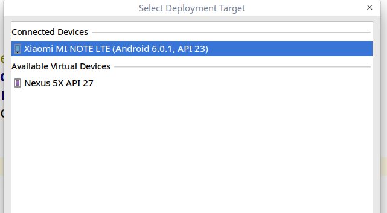
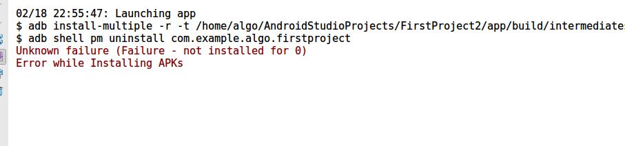

# android安装  
1.直接安装android studio就行，deepin store里直接下载安装, 在android studio里可以编辑安装android sdk
修改安装路径在/home/algo/lib/android/sdk里, 使用android studio的自动安装sdk帮助我们安装,剩下就是修改安装路径。  
以后相关sdk等直接安装在lib里了，不再安装在/usr/local里了，除非是公用的
记录一个相关android sdk下载源：
```
http://mirrors.neusoft.edu.cn/android/repository/
```
如果不方便修改地址，一个好的方式是先找到替代源的机器的ip，然后修改机器的hosts，
讲dl.google.com指向到新的ip地址就可以了！！！  
修改hosts的方式可以很好的做到欺骗啊！！ 这基本也是一种钓鱼的方式了！
记住这方式，非常的好用,这相当于一种反向代理了或者dynamic balance了，只要远程的服务是一样的(无状态的)，
使用这种方式就可以很好的方便的解决安装各种软件安装问题。
一个AI：  
前段js的请求也可以这么做到负载均衡！
负载均衡和timeout的研究  

2.android studio安装后，需要升级一下，升级到最新版本，直接以root身份执行脚本：
```
sudo sh /opt/android-studio/bin/studio.sh
```
启动后会显示一个小框，在event里选择升级，然后关掉以普通用户启动在启动就行

# adb 使用和问题　　
### adb 的使用　　
adb是与android调试的工具，需要使用root用户启动　　

常用命令：
```
adb kill-server
adb start-server
adb devices
```
adb 截图和拉取：
```
adb shell screencap -p /sdcard/autojump.png
adb pull /sdcard/autojump.png .
```

adb点击：
```
adb shell input swipe x y x y times(ms)
```
### adb shell 命令介绍  
```
usage: input ...
       input text <string>
       input keyevent <key code number or name>
       input [touchscreen|touchpad|touchnavigation] tap <x> <y>
       input [touchscreen|touchpad|touchnavigation] swipe <x1> <y1> <x2> <y2> [duration(ms)]
       input trackball press
       input trackball roll <dx> <dy>
```

##### adb shell input tab点击：  
打开设备的拾取功能，就可以有屏幕坐标拾取  
adb shell input tab x y  
```
adb shell input tap 100 100 
```

##### adb shell input swipe:
既可以点击也可以滑动：
```
//滑动
adb shell input swipe 100 100 200 200 300 //从 100 100 经历300毫秒滑动到 200 200 
//长按
adb shell input swipe 100 100 100 100 1000 //在 100 100 位置长按 1000毫秒
adb shell input swipe 100 100 100 100 800 //在点(100,100)处长按800ms
```

##### input text
```
adb shell input text "gao" //输入法输入 高
adb shell input text "1"    //选择第一个字符
```

##### input keyevent 
常用的指令：
input keyevent 3    // Home
input keyevent 4    // Back
input keyevent 19  //Up
input keyevent 20  //Down
input keyevent 21  //Left
input keyevent 22  //Right
input keyevent 23  //Select/Ok
input keyevent 24  //Volume+
input keyevent 25  // Volume-
input keyevent 82  // Menu 菜单
eg:
```
root@algo-PC:~# adb shell input keyevent 4  //后退
root@algo-PC:~# adb shell input keyevent 25 //第一次调用出调节界面
root@algo-PC:~# adb shell input keyevent 25 //后续是调小音量
root@algo-PC:~# adb shell input keyevent 25
root@algo-PC:~# adb shell input keyevent 25
```
也可以发送单个键盘字母
eg:
```
adb shell input keyevent KEYCODE_A //发送字母a
adb shell input keyevent KEYCODE_I //发送字母i
adb shell input keyevent KEYCODE_2 //数字２(如果有输入法，会选择第二个字符)
adb shell input keyevent KEYCODE_3 //数字３
```

### adb 找不到手机问题
android已经开启了developer 模式　　
adb 需要手动启动，但是手动启动后，还是没发现连接的android实体机器, 
执行命令：
```
algo@algo-PC:~$ adb devices
List of devices attached

```
即使重启adb后也无反应：
```
algo@algo-PC:~$ adb kill-server
algo@algo-PC:~$ adb start-server
algo@algo-PC:~$ adb devices
List of devices attached

```
最后换了数据线，重启动adb就好了,查看到
```
algo@algo-PC:~$ adb devices
List of devices attached
92703380	unauthorized

```
在android stadio里就可以看到：  
 


安装应用失败：



出现此问题的原因是adb没有权限，adb必须以root的身份运行，所以需要如此执行：
```
sudo adb start-server
信息如下：
root@algo-PC:/home/algo/PycharmProjects/blog/opencv# adb start-server
* daemon not running; starting now at tcp:5037
* daemon started successfully
```
或者暴力提权限
```
sudo chmod a+s adb
```

Reference:  
http://blog.csdn.net/encourage2011/article/details/53525297
https://www.cnblogs.com/lswsqhy/p/7004530.html
https://www.linuxidc.com/Linux/2014-01/94931.htm
http://bbs.csdn.net/topics/392029387
https://www.jianshu.com/p/c9ab9f8b99e4
adb shell介绍：
http://blog.csdn.net/soslinken/article/details/49587497

Appendix A:
android keyevent 指令对应:
0 –> “KEYCODE_UNKNOWN” 
1 –> “KEYCODE_MENU” 
2 –> “KEYCODE_SOFT_RIGHT” 
3 –> “KEYCODE_HOME” 
4 –> “KEYCODE_BACK” 
5 –> “KEYCODE_CALL” 
6 –> “KEYCODE_ENDCALL” 
7 –> “KEYCODE_0” 
8 –> “KEYCODE_1” 
9 –> “KEYCODE_2” 
10 –> “KEYCODE_3” 
11 –> “KEYCODE_4” 
12 –> “KEYCODE_5” 
13 –> “KEYCODE_6” 
14 –> “KEYCODE_7” 
15 –> “KEYCODE_8” 
16 –> “KEYCODE_9” 
17 –> “KEYCODE_STAR” 
18 –> “KEYCODE_POUND” 
19 –> “KEYCODE_DPAD_UP” 
20 –> “KEYCODE_DPAD_DOWN” 
21 –> “KEYCODE_DPAD_LEFT” 
22 –> “KEYCODE_DPAD_RIGHT” 
23 –> “KEYCODE_DPAD_CENTER” 
24 –> “KEYCODE_VOLUME_UP” 
25 –> “KEYCODE_VOLUME_DOWN” 
26 –> “KEYCODE_POWER” 
27 –> “KEYCODE_CAMERA” 
28 –> “KEYCODE_CLEAR” 
29 –> “KEYCODE_A” 
30 –> “KEYCODE_B” 
31 –> “KEYCODE_C” 
32 –> “KEYCODE_D” 
33 –> “KEYCODE_E” 
34 –> “KEYCODE_F” 
35 –> “KEYCODE_G” 
36 –> “KEYCODE_H” 
37 –> “KEYCODE_I” 
38 –> “KEYCODE_J” 
39 –> “KEYCODE_K” 
40 –> “KEYCODE_L” 
41 –> “KEYCODE_M” 
42 –> “KEYCODE_N” 
43 –> “KEYCODE_O” 
44 –> “KEYCODE_P” 
45 –> “KEYCODE_Q” 
46 –> “KEYCODE_R” 
47 –> “KEYCODE_S” 
48 –> “KEYCODE_T” 
49 –> “KEYCODE_U” 
50 –> “KEYCODE_V” 
51 –> “KEYCODE_W” 
52 –> “KEYCODE_X” 
53 –> “KEYCODE_Y” 
54 –> “KEYCODE_Z” 
55 –> “KEYCODE_COMMA” 
56 –> “KEYCODE_PERIOD” 
57 –> “KEYCODE_ALT_LEFT” 
58 –> “KEYCODE_ALT_RIGHT” 
59 –> “KEYCODE_SHIFT_LEFT” 
60 –> “KEYCODE_SHIFT_RIGHT” 
61 –> “KEYCODE_TAB” 
62 –> “KEYCODE_SPACE” 
63 –> “KEYCODE_SYM” 
64 –> “KEYCODE_EXPLORER” 
65 –> “KEYCODE_ENVELOPE” 
66 –> “KEYCODE_ENTER” 
67 –> “KEYCODE_DEL” 
68 –> “KEYCODE_GRAVE” 
69 –> “KEYCODE_MINUS” 
70 –> “KEYCODE_EQUALS” 
71 –> “KEYCODE_LEFT_BRACKET” 
72 –> “KEYCODE_RIGHT_BRACKET” 
73 –> “KEYCODE_BACKSLASH” 
74 –> “KEYCODE_SEMICOLON” 
75 –> “KEYCODE_APOSTROPHE” 
76 –> “KEYCODE_SLASH” 
77 –> “KEYCODE_AT” 
78 –> “KEYCODE_NUM” 
79 –> “KEYCODE_HEADSETHOOK” 
80 –> “KEYCODE_FOCUS” 
81 –> “KEYCODE_PLUS” 
82 –> “KEYCODE_MENU” 
83 –> “KEYCODE_NOTIFICATION” 
84 –> “KEYCODE_SEARCH” 
85 –> “TAG_LAST_KEYCODE” 
