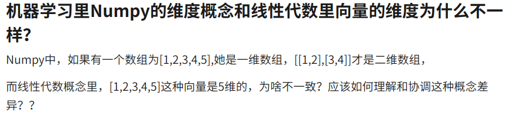
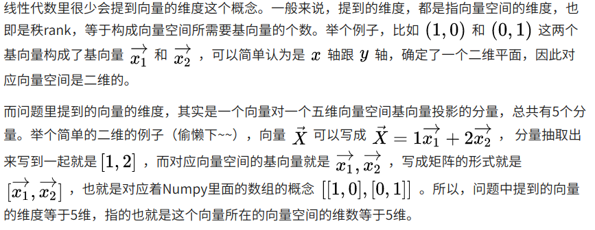

#opencv 常用API
imread(img_path)    //图片读取
imwrite(img_path, img)  //图片保存
imshow(name, img)   //显示图片
waitKey(time_ms)    //传入时间是表示delay多少秒返回，可以用来等待输入，也可以用来控制视频图片播放的速度
```
ret, frame = capture.read()
frame = cv.flip(frame, 1)
cv.imshow("video", frame)
c = cv.waitKey(30) //30ms 返回，可以用来控制视频播放的速度，如24帧每秒是正常的播放速度，那么1000/24=41.6，41ms/帧 设置delay(41)视频播放正常
if c == 27:
            break
```

VideoCapture(video_path_or_device_num)      //参数是video的路径或者摄像头路径
eg:
```
capture = cv.VideoCapture(0)
capture = cv.VideoCapture("/home/algo/Videos/The.Big.Bang.Theory.S01E01.mkv")
ret, frame = capture.read() //去读视频内容
```

flip(frame, flip_code) //frame是要翻转的图片，flip_code含义：0=翻转x轴, >0表示翻转y轴, <0表示x,y轴一起翻转
eg:
```
frame = cv.flip(frame, 1) //沿y轴翻转，使显示正常
```


getTickCount() //两个接口组合可以求消耗的时间
getTickFrequency()


resize() //大小缩放


# numpy 的使用
numpy的narray对象中的数据排列是和图像的是一致的！  
原因是numpy中数组组织是按高维向下的组织的， 
[z,y,x,...,a],   
这样的理解反而不好理解，底层存储肯定是连续存储(的尤其是c order风格的),[]符号将各个维度乘起来就定位到了元素,
维度不过是用来计算的，直接照线性代数的概念理解会比存储的理解方式好理解.
看了几篇博客还是线性代数的概念理解直观！  
以下两张图中的问答完美的诠释了numpy中的维度和向量的关系，其实理解与数学中的概念直接对应的话，
可以直接不用理解底层的存储的问题了, 直接与数学中的概念对应上就行：  



Reference:
https://www.zhihu.com/question/263475425

## numpy中常用的API
ones(shape=(z,y,x,....,a), dtype)  //shape是维度，dtype默认是np.float64  
fill(dtype)  //dtype   
reshape(shape=(z,y,x...))  //shape是重新reshape后的结果,将 narray重新reshape到新的数组    
下面的例子是将维度(3,4)压缩到1维度空间
```
>>> m1=np.ones((3,4),np.uint32)
>>> m1.fill(12.88)
>>> print(m1)
[[12 12 12 12]
 [12 12 12 12]
 [12 12 12 12]]
>>> m2=m1.reshape((1,9))
Traceback (most recent call last):
  File "<stdin>", line 1, in <module>
ValueError: cannot reshape array of size 12 into shape (1,9)
>>> m2=m1.reshape((1,12))
>>> print(m2)
[[12 12 12 12 12 12 12 12 12 12 12 12]]
```

np.narray的数组同样用array就可以申明，比如:  
```
#first
m2 = np.ones((3,3), np.uint)
m2.fill(18)
print(m2)
#second
m3 = np.array(((1,2,3),(4,5,6),(7,8,9)), np.uint)  //这种方式在卷积filter申明的时候更好用
m3.fill(19)
print(m3)
```


