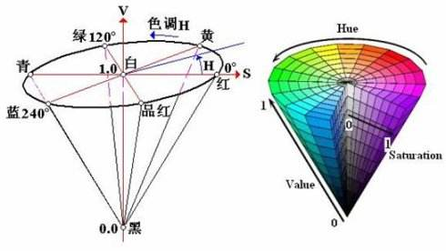
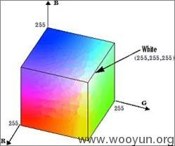

# 图像的色彩空间
色彩空间是一个颜色显示的模型，比如RGB,HSV,YCrCb,YUV.
下图是RGB和HSV色彩空间的模型图：



介绍常用的集中颜色表示模型:
RGB: opencv里是BGR, 三颜色通道，  
HSV: 最常用的颜色空间，H(Hue)指色调，S(Saturation)指饱和度，V(value)指明度  
饱和度S是指白色在色调里混合的比例，色调H是固定的，S越高混合的白色越多，越趋近与白色；
V是明度，不管哪一个色调，V值越小，明度越低，色调就越灰暗，趋近于黑色,但不会完全趋近黑色, 暗黑浓的色一般都是v值低的 
白色的V值变化就是V值的变化  
从HSV锥形图中可以看出H的取值范围应该是360, 但是超过了opencv中图像的uint8表示范围0-255, 
所以正则化180.  S和V的取值着没有特别规定，按0-255取值.  
所以取值范围为: H in [0, 180], S in [0, 255], V in [0, 255]  
下图是常用的hsv取值范围, 在设置或者过滤颜色的时候就非常有用了： 

YCrCb: 为识别人的皮肤的模型  
YUV： android中的摄像头获取到的颜色模型  
CMY: 早期的射线屏幕使用，现在都已经是RGB模型

RGB和CMY颜色模型都是面向硬件的，而HSV（Hue Saturation Value）颜色模型是面向用户的。

以上中都有对应的API提供可以转换  

# 色彩空间转换API
```
cv.cvtColor(img, cv.COLOR_BRG2HSV)
cv.cvtColor(img, cv.COLOR_BRG2GRAY)
```

# inRange函数


# 通道分离和合并  
颜色通道可以单独提取出来处理后再然后合并！  


# 像素运算
相同size大小的图片(即相同维度和大小numpy.array的数组)才可以进行运算操作！  
基本运算：  
加，减，乘，除  
基本逻辑运算：  
and, or, not  

注意的是图片的

Reference:
HSV颜色模型:
https://www.cnblogs.com/wangyblzu/p/5710715.html
